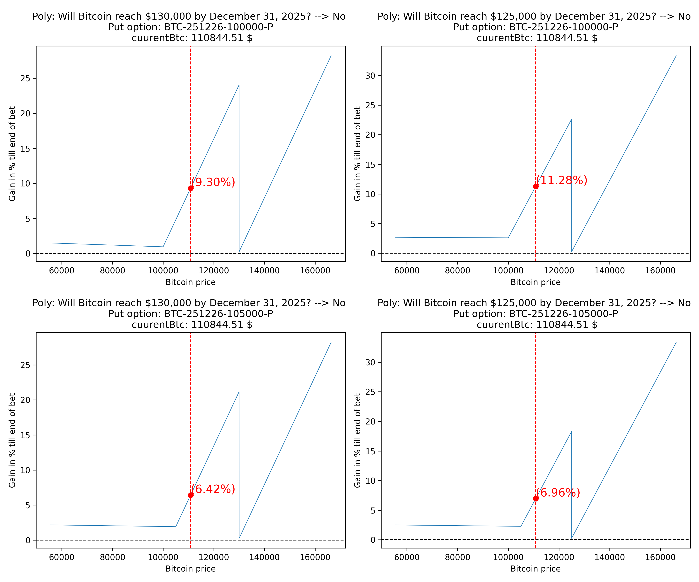

# Binance ↔️ Polymarket Arbitrage — *Put/Spot/Bet*


## What is this?
A **trading system** that searches for **arbitrage opportunities between Binance and Polymarket**.  
This repo implements a *buy-and-hold* trio strategy that combines:
- **Short** exposure on **Polymarket** (binary bet),
- **Long spot** on **Binance**,
- **Long put option** on **Binance** (as a tail-risk hedge).

This is a **personal hobby project** intended for learning and experimentation — **not** a production-grade trading platform and **not** financial advice.

---

## Strategy Explanation
The core logic lives in `PutSpotBet_ArbitrageStrategy`, conceptually summarized below:

```python
class PutSpotBet_ArbitrageStrategy:
    """
    Goes long/short:
    * Short on Polymarket (binary bet),
    * Long spot on Binance,
    * Long put option on Binance.

    IMPORTANT:
    Assumes strict buy-and-hold (no re-hedging). This can lead to losses.
    Use as a base for more advanced, reactive strategies.
    """
```
**Inputs**
- `capital_to_invest`: total capital allocated to the trio position  
- `cryptoSpotMarket`: spot market snapshot (Binance)  
- `cryptoPutMarket`: put option market (Binance)  
- `polyMarketBet`: binary bet market (Polymarket)  
- `minrelativeGainWhenBetIsLost`: minimum relative gain targeted when the **bet loses** (default `0.0` ≙ breakeven)

**High-level algorithm**
1. **Pair the markets** (spot, bet, put) on the same underlying (e.g., BTC).  
2. **Normalize payoffs** to a comparable basis (binary bet resolves to 0/1 USD; spot/put priced in crypto/USD).  
3. **Allocation anchor**: set the anchor at the **Polymarket bet strike** (price where the bet resolves to 0).  
   At this anchor, the method `_allocate_consider_liquidity_no_fees(...)` searches for allocations that satisfy:
   - Hedge coverage with the put against adverse spot moves (even large drawdowns).  
   - Put shares ≥ spot exposure / spot price.  
   - P&L line crosses **break-even below** the put strike to ensure the put meaningfully protects downside.  
   - Liquidity is considered via orderbook pulls for **bet** and **put**; **spot** is assumed highly liquid.
4. **Arbitrage filter**: after assembling the P&L curve, only keep opportunities where the **minimum** of the **relative P&L** distribution is **> 0** (strictly positive across scenarios), *ignoring fees*.
5. **Profit/Loss curve**: `calculate_profit_loss_curve(spot_prices)` returns a dict with allocations, average prices, payoff components, relative P&L distribution, and an `arbitrage` boolean flag.

> ⚠️ **Buy-and-hold only.** The implementation **does not react** to market movements after entry. See `calculate_profit_loss_curve` in the code for how outcomes are stitched across three regions:  
> (i) above bet strike (bet = 0), (ii) between bet and put strike (bet = 1, put = 0), (iii) below put strike (bet = 1, put in the money).

**Known assumptions / caveats (from the code comments)**
- **Fees not modeled** (trading fees, gas).  
- **Mismatched expiries** between Binance options and Polymarket bet close are possible (ideally, Polymarket closes **before** the option expires).  
- **Jurisdictional access**: Binance/Polymarket may not be legal/available in some countries.  
- **Lot size**: Binance put options may have a **min contract size (e.g., 0.01)**; scaling/rounding can change cost/fee structure.  
- **Liquidity**: bet/put liquidity is explicitly considered; spot assumed very liquid.  
- **No guarantee of true arbitrage** in live markets due to latency and fills.

---

## Results

The following results consider market data from the following three markets:

1. [BTC Options Binance](https://www.binance.com/en/eoptions/BTCUSDT?symbol=BTC-251226-100000-P)
2. [BTC Spot Market Binance](https://www.binance.com/en/trade/BTC_USDT?type=spot)
3. [Polymarket Bet: What price will Bitcoin hit in 2025?](https://polymarket.com/event/what-price-will-bitcoin-hit-in-2025?tid=1757024722768)


This chart shows the P&L curve of the tripple invest over a range of possibles bitcoin prices for the end of the year 2025.
The chart is non negative which means considering the above assumptions this market should be [**free lunch**](https://de.wikipedia.org/wiki/No-free-Lunch-Theoreme)

<p align="center">
  
</p>


Assuming buying the following amounts of assets at 4th of september 3:27 GMT-7 the top left chart would describe the resulting profit
over all bitcoin prices at the end of the year 2025:

```
Will Bitcoin reach $130,000 by December 31, 2025?
BTC-251226-100000-P
currentSpotMarketPrice: 110844.51

to_be_invested_in_bet: 1072.1829788461548  --> if won: 2382.628841880344
to_be_invested_in_put: 380.0 --> get 0.07835051546391752 shares
to_be_invested_in_spot: 8547.817021153845 --> get 0.07711538461538461 btcs
total investment: 10000
```

## Traceability

To make the results recomputable understandable and open for evaluation the code includes the order books for the above shown plot for all of the three markets.

**If any mistakes are found opening an issue on this repository is highly appreciated**

---

## Getting Started

### Prerequisites
- Python 3.12+ recommended 
- Virtual environment (`venv`/`conda`)  

### Setup
```bash
git clone https://github.com/Schubert-Tom/polymarket-binance-arbitrage.git
cd polymarket-binance-arbitrage
python -m venv .venv && source .venv/bin/activate  # Windows: .venv\Scripts\activate
pip install -r requirements.txt
```
---

## Ideas for further implementations
- [ ] Fee modeling
- [ ] Robust allocation optimizer (with constraints & fees)
- [ ] Check multiple market pairs
- [ ] Backtest/Simulate the strategy over a period of time

---

## Disclaimer
This repository is provided **for educational and research purposes only**. **No financial advice.**  
**I am not responsible for any financial losses** or damages incurred from the use of this system, whether direct or indirect. **Use at your own risk.**  
Before interacting with real markets, **understand the legal, technical, and financial risks** involved in your jurisdiction.
